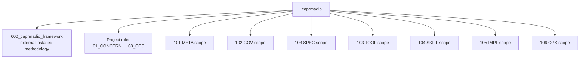

# Applied project-wide CAPRMADIO artifacts

## Purpose

Project-level carriers live directly in the ordered Content-role folders under
`.caprmadio`. Structural scopes repeat the same role layout beneath their own
directories.

## Boundaries

Layer-specific truth belongs to the corresponding applied layer. The external
installed methodology remains isolated under `000_caprmadio_framework`.
Native implementation remains outside `.caprmadio`; only governed
Implementation carriers and journals belong under `07_IMPLEMENTATION`.

## Start here

- Project roles: `01_CONCERN` through `08_OPS`, materialized when used.
- Structural scopes: `101_layer_meta` through `106_layer_ops`.
- Installed methodology: `000_caprmadio_framework`.
- Settings: `caprmadio_settings.toml`.
