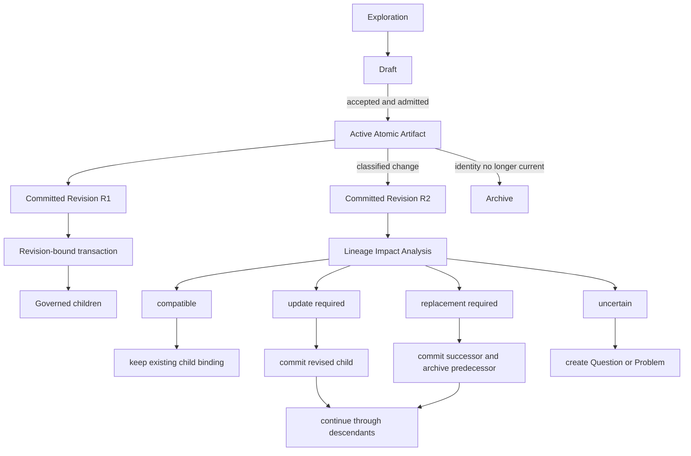

# Specification — Atomic Artifacts and Definitions

## Purpose and authority boundary

This Specification is the maintained current model for Atomic Artifacts and the Definition-role Types Requirement, Constraint, and Contract. Atomic Artifacts remain authoritative for every represented claim. This view organizes and interprets that authority without replacing it.

The Specification covers atomic identity, committed revisions, carriers, scope, provenance, relations, dependency transactions, lineage-impact review, admission, change, archival, and the complete Definition vertical slice. Other concrete Content-role Types remain outside this version except where they participate in atomic lineage.

## Domain flow



Atomic sources: DSET-REQUIREMENT-META-055, DSET-REQUIREMENT-META-058, DSET-REQUIREMENT-META-073, DSET-REQUIREMENT-META-075, DSET-REQUIREMENT-META-077, DSET-REQUIREMENT-GOV-120, DSET-REQUIREMENT-GOV-127, DSET-REQUIREMENT-GOV-128, DSET-REQUIREMENT-GOV-129.

## Ordered entity definitions

Each definition uses only ordinary language and entities defined above it. Connections to later entities appear in the following section.

| Entity | Definition | Atomic sources |
|---|---|---|
| **Revision mode** | The permitted way a persisted item changes: `atomic` has immutable committed revisions under one governed identity, `append_only` adds complete immutable records in order, and `maintained` revises a current carrier through its governed procedure | DSET-REQUIREMENT-META-073 |
| **Content role** | The primary semantic contribution of persisted material: Problem, Analysis, Definition, Method, Assurance, Implementation, or Observation | DSET-REQUIREMENT-META-069 |
| **Governance locus** | The ownership shape of meaning: `internal` is project-owned, `external` is imposed or owned outside the project, and `relation` exists between explicit participants | DSET-REQUIREMENT-META-069 |
| **Scope path** | One project-relative structural address identifying the artifact owner; the current project is ambient | DSET-REQUIREMENT-META-052, DSET-REQUIREMENT-META-071 |
| **Subject scope** | One governed layer-local search token identifying the bounded subject discussed inside a Scope path | DSET-REQUIREMENT-META-071, DSET-REQUIREMENT-GOV-122, DSET-REQUIREMENT-GOV-124 |
| **Primary claim** | One independently implementable, checkable, resolvable, revisable, and replaceable assertion | DSET-REQUIREMENT-META-074 |
| **Artifact type** | The canonical semantic classifier occupying one complete combination of Revision mode, Content role, and Governance locus | DSET-REQUIREMENT-META-035, DSET-REQUIREMENT-META-070, DSET-REQUIREMENT-GOV-102 |
| **Atomic Artifact** | One stable artifact identity owning one Primary claim, one Scope path, an allowed Artifact type, and a sequence of immutable committed revisions | DSET-REQUIREMENT-META-071, DSET-REQUIREMENT-META-073, DSET-REQUIREMENT-META-074 |
| **Atomic Revision** | The exact committed carrier state of one Atomic Artifact at one reachable Git commit | DSET-REQUIREMENT-META-073, DSET-REQUIREMENT-META-076 |
| **Carrier** | The project file or native repository object that presents a governed artifact revision in its prescribed format | DSET-REQUIREMENT-GOV-116 |
| **Draft** | A mutable pre-admission Carrier without an artifact ID, authority, sequence number, or eligibility as a relation target | DSET-REQUIREMENT-META-073, DSET-REQUIREMENT-GOV-120 |
| **Artifact relation** | One typed forward semantic connection authored on a source artifact and naming one or more target artifact identities | DSET-REQUIREMENT-META-051, DSET-IMPL-GOV-004 |
| **Dependency transaction** | One Git commit that consumes exact Atomic Revisions and produces new or updated governed children in one Scope path | DSET-REQUIREMENT-META-075, DSET-REQUIREMENT-GOV-126 |
| **Lineage branch** | One forward chain of Dependency transactions from an Atomic Revision through its direct and recursive descendants | DSET-REQUIREMENT-META-077 |
| **Change class** | One exclusive classification of an admitted Atomic Artifact change as `carrier_only`, `refinement`, `semantic_revision`, or `replacement` | DSET-REQUIREMENT-GOV-128 |
| **Impact disposition** | One exclusive conclusion for a directly examined child: `compatible`, `update_required`, `replacement_required`, or `uncertain` | DSET-REQUIREMENT-GOV-127 |
| **Lineage Impact Analysis** | One atomic Analysis Report concluding whether every affected Lineage branch for one changed Atomic Revision is complete or blocked | DSET-REQUIREMENT-GOV-129 |
| **Definition** | An atomic Primary claim describing an intended result, obligation, boundary, or required state without selecting the implementation method | DSET-REQUIREMENT-META-069, DSET-REQUIREMENT-META-074 |
| **Requirement** | An internal Definition established by the project | DSET-REQUIREMENT-GOV-121 |
| **Constraint** | An external Definition imposed or owned by an identified outside authority or system | DSET-REQUIREMENT-META-056, DSET-REQUIREMENT-GOV-057, DSET-REQUIREMENT-GOV-121 |
| **Relation endpoint** | One participant in relational governance with an explicit role, identity, and independently declared internal or external origin | DSET-REQUIREMENT-META-051 |
| **Contract** | A relational Definition establishing one obligation among at least two Relation endpoints | DSET-REQUIREMENT-META-051, DSET-REQUIREMENT-META-056, DSET-REQUIREMENT-GOV-121 |
| **Specification** | A maintained internal Definition view that presents current meaning from Atomic Artifacts without becoming their authority | DSET-REQUIREMENT-META-079, DSET-REQUIREMENT-GOV-130 |

## Cross-entity connections

| Connection | Source | Target | Meaning | Atomic sources |
|---|---|---|---|---|
| `classifies` | Artifact type | Atomic Artifact | Supplies the artifact's complete semantic route | DSET-REQUIREMENT-META-035 |
| `owns` | Scope path | Atomic Artifact | Identifies the one structural owner | DSET-REQUIREMENT-META-071 |
| `revises` | Atomic Revision | Atomic Artifact | Preserves one committed version under the stable identity | DSET-REQUIREMENT-META-073 |
| `presents` | Carrier | Atomic Revision | Makes the committed semantic or native content inspectable | DSET-REQUIREMENT-GOV-116 |
| `connects` | Artifact relation | Atomic Artifact | States one typed semantic edge between identities | DSET-IMPL-GOV-004 |
| `consumes` | Dependency transaction | Atomic Revision | Binds work to the exact parent meaning used | DSET-REQUIREMENT-META-075 |
| `produces` | Dependency transaction | Carrier | Creates or updates a governed child | DSET-REQUIREMENT-GOV-126 |
| `traverses` | Lineage Impact Analysis | Lineage branch | Accounts for downstream consequences | DSET-REQUIREMENT-META-077, DSET-REQUIREMENT-GOV-129 |
| `assigns` | Lineage Impact Analysis | Impact disposition | Records the result for each directly examined child | DSET-REQUIREMENT-GOV-127, DSET-REQUIREMENT-GOV-129 |
| `specializes` | Requirement | Definition | Gives Definition internal Governance locus | DSET-REQUIREMENT-GOV-121 |
| `specializes` | Constraint | Definition | Gives Definition external Governance locus | DSET-REQUIREMENT-GOV-121 |
| `participates_in` | Relation endpoint | Contract | Makes relational obligation participants explicit | DSET-REQUIREMENT-META-051 |
| `specializes` | Contract | Definition | Gives Definition relation Governance locus | DSET-REQUIREMENT-GOV-121 |
| `represents` | Specification | Atomic Artifact | Presents current meaning while retaining direct atomic provenance | DSET-REQUIREMENT-META-079, DSET-REQUIREMENT-GOV-130 |

## Atomic invariants

1. One Atomic Artifact owns exactly one Primary claim. Supporting rationale, examples, criteria, and relations may remain only when they bound that claim. Atomic source: DSET-REQUIREMENT-META-074.
2. One artifact ID identifies one continuing Primary claim across committed revisions. A different Primary claim requires another ID. Atomic sources: DSET-REQUIREMENT-META-073, DSET-REQUIREMENT-GOV-128.
3. Every committed revision is immutable and reachable through Git. Atomic sources: DSET-REQUIREMENT-META-073, DSET-REQUIREMENT-META-076.
4. Every dependency consumes an exact committed parent revision. Later revisions do not retarget existing children. Atomic source: DSET-REQUIREMENT-META-075.
5. Every admitted non-carrier change is classified and receives lineage-impact review. Atomic sources: DSET-REQUIREMENT-META-077, DSET-REQUIREMENT-GOV-128, DSET-REQUIREMENT-GOV-129.
6. Git establishes provenance, not claim correctness or assurance. Atomic source: DSET-REQUIREMENT-META-078.
7. Frontmatter stores only explicit, non-derived properties. Artifact type determines Revision mode, Content role, and Governance locus. Atomic source: DSET-REQUIREMENT-META-038.
8. Current and archived conditions derive from carrier placement; no frontmatter status duplicates them. Atomic sources: DSET-REQUIREMENT-META-038, DSET-REQUIREMENT-GOV-120.
9. Active atoms describe current work. Deferred intent belongs in a Version Roadmap rather than an active Definition. Atomic sources: DSET-REQUIREMENT-META-053, DSET-DECISION-GOV-035.
10. A Specification never becomes evidence merely by citing an atom and never becomes authority by restating it. Atomic sources: DSET-REQUIREMENT-META-078, DSET-REQUIREMENT-META-079.

## Common Atomic Artifact carrier

Atomic Artifacts use Markdown with YAML frontmatter unless an external boundary or native artifact Type requires another carrier. Every controlled string value is an unquoted YAML-safe scalar. Atomic sources: DSET-REQUIREMENT-GOV-116, DSET-REQUIREMENT-GOV-123.

Controlled vocabulary defaults to lowercase kebab-case, while registered grammars retain their governed forms, including uppercase artifact identities and underscore-based relation kinds. Atomic source: DSET-REQUIREMENT-GOV-123.

```yaml
---
artifact_type: requirement
artifact_id: PROJ-GOV-REQU-001
scope_path: layer:gov
subject_scopes:
  - artifact-catalog
priority: high
llm_session_ids:
  - codex:session-id
relations:
  - type: child_of
    targets:
      - PROJ-META-REQU-001
---
```

| Property | Cardinality | Meaning | Atomic sources |
|---|---:|---|---|
| `artifact_type` | exactly one | Registered canonical Type; determines the semantic route | DSET-REQUIREMENT-META-035, DSET-REQUIREMENT-GOV-102 |
| `artifact_subtype` | zero or one | Enabled direct subtype inheriting the complete Type route | DSET-REQUIREMENT-META-070, DSET-REQUIREMENT-GOV-102 |
| `artifact_id` | exactly one | Stable project and scope-qualified identity | DSET-REQUIREMENT-GOV-113, DSET-REQUIREMENT-GOV-114, DSET-REQUIREMENT-GOV-119 |
| `scope_path` | exactly one scalar | Project-relative structural owner | DSET-REQUIREMENT-META-071, DSET-REQUIREMENT-GOV-122 |
| `subject_scopes` | type-governed | Layer-local discovery subjects | DSET-REQUIREMENT-GOV-122, DSET-REQUIREMENT-GOV-124 |
| `priority` | exactly one | Conflict-selection and execution precedence input | DSET-REQUIREMENT-GOV-107 |
| `llm_session_ids` | one or more when LLM-assisted | Session provenance for creation or revision | DSET-REQUIREMENT-GOV-116 |
| `relations` | zero or more | Typed semantic connections stored on the source | DSET-IMPL-GOV-004 |
| Type-specific properties | as required | Non-derived facts such as Contract endpoints | DSET-REQUIREMENT-META-038, DSET-REQUIREMENT-META-051 |

The carrier omits `revision_mode`, `content_role`, `governance_locus`, project identity, acceptance status, active/archive status, and any duplicated prose. Atomic source: DSET-REQUIREMENT-META-038.

## Atomic carrier lifecycle

| Derived condition | Entry criteria | Exit criteria | Allowed next condition | Required durable record | Atomic sources |
|---|---|---|---|---|---|
| **Draft** | Candidate carrier exists under the Type-local `drafts/` folder without an artifact ID | Candidate is admitted or discarded | Active or absent | None until admission | DSET-REQUIREMENT-META-073, DSET-REQUIREMENT-GOV-120 |
| **Active** | Operator acceptance, admission validation, identity allocation, active placement, and initial Git commit complete | A same-ID revision is committed or the identity is archived | Active or Archived | Governed creation or update commit | DSET-REQUIREMENT-GOV-112, DSET-REQUIREMENT-GOV-120, DSET-REQUIREMENT-GOV-126 |
| **Archived** | Governed transaction moves the unchanged current carrier to the Type-local archive after replacement, resolution, recurrence handling, or withdrawal | Terminal for this identity | None | Archive transaction and applicable successor or Version reference | DSET-DECISION-GOV-035, DSET-REQUIREMENT-GOV-120, DSET-REQUIREMENT-GOV-126 |

An archived Atomic Artifact never returns to active placement. A recurring Question or Problem receives a new ID and `recurrence_of`; a continuing Primary claim may evolve only while its identity remains active. Atomic sources: DSET-DECISION-GOV-035, DSET-REQUIREMENT-GOV-128.

## Revision change model

| Change class | Same artifact ID | Meaning change | Lineage Impact Analysis | Result |
|---|---:|---:|---:|---|
| `carrier_only` | yes | none | no | Commit verified lossless recoding |
| `refinement` | yes | acceptance-equivalent clarification or tightening | yes | Commit updated atom revision |
| `semantic_revision` | yes | same Primary claim with changed meaning or applicability | yes | Commit updated atom revision |
| `replacement` | no | different Primary claim or claim decomposition/composition | yes | Commit successor and archive predecessor when fully replaced |

Atomic sources: DSET-REQUIREMENT-GOV-108, DSET-REQUIREMENT-GOV-128.

The revision commit and any dependent implementation or artifact change occur in separate ordered transactions because a commit cannot name its own not-yet-known hash as a parent revision. Atomic sources: DSET-REQUIREMENT-META-075, DSET-REQUIREMENT-GOV-126.

## Lineage-impact model

| Impact disposition | Entry criterion | Required action | Branch exit criterion | Atomic sources |
|---|---|---|---|---|
| `compatible` | Child remains valid against its consumed earlier parent revision | Record the assessment; do not rewrite the child | Reasoned compatibility is recorded | DSET-REQUIREMENT-GOV-127, DSET-REQUIREMENT-GOV-129 |
| `update_required` | Same child identity remains valid but its carrier must change | Commit a new child revision and continue through its descendants | Descendant branches reach fixed point | DSET-REQUIREMENT-META-077, DSET-REQUIREMENT-GOV-127 |
| `replacement_required` | Child Primary claim identity no longer fits | Commit successor, archive predecessor when fully replaced, and continue through affected descendants | Successor lineage reaches fixed point | DSET-REQUIREMENT-GOV-127, DSET-REQUIREMENT-GOV-128 |
| `uncertain` | Material effect cannot be classified safely | Create a Question or Problem and stop the branch | Blocking atom is resolved and review resumes | DSET-REQUIREMENT-GOV-127, DSET-REQUIREMENT-GOV-129 |

One Lineage Impact Analysis owns the conclusion for one changed parent revision. Child rows are supporting analysis bound to exact revisions; they do not become replacement authority or self-evidence. Atomic sources: DSET-REQUIREMENT-META-078, DSET-REQUIREMENT-GOV-129.

## Definition boundary

A Definition states what must become or remain true. It may state acceptance criteria, applicability, boundaries, and measurable outcomes that clarify one obligation. It must not select code structure, library choice, algorithm, workflow, test mechanism, evaluation method, or deployment procedure unless that choice is itself imposed by the Definition's external or relational authority.

Every Definition:

- owns one independently replaceable obligation or intended result;
- uses present-tense current project meaning;
- states its applicable subject and boundary;
- distinguishes normative content from rationale and examples;
- keeps implementation choices in Method or Implementation artifacts;
- links Tests and Evaluations through `check_of` rather than embedding their execution; and
- moves deferred future-version intent to the applicable Version Roadmap.

Atomic sources: DSET-REQUIREMENT-META-053, DSET-REQUIREMENT-META-074, DSET-REQUIREMENT-GOV-121.

### Definition Type selection

| Question | Yes | No |
|---|---|---|
| Is the obligation owned by the current project rather than imposed outside it? | Requirement | Continue |
| Is the obligation imposed or owned by an outside authority, system, standard, or existing interface? | Constraint | Continue |
| Does the obligation exist between two or more explicit role-bearing participants? | Contract | The candidate is not yet a valid Definition |

Requirement, Constraint, and Contract occupy the internal, external, and relation Governance loci for atomic Definition. Atomic source: DSET-REQUIREMENT-GOV-121.

## Requirement

### Canonical meaning

A Requirement is one project-owned intended result, obligation, invariant, or behavior. It says what the project accepts as current normative truth without prescribing an implementation method.

### Entry criteria

- The operator has explicitly accepted the obligation.
- The claim is internally owned.
- Exactly one Primary claim can be implemented, checked, revised, and replaced independently.
- Scope path, Subject scope, priority, provenance, and material relations are known.
- Acceptance criteria are precise enough for the configured admission strictness.
- The claim concerns current work rather than deferred roadmap intent.

### Exit and change criteria

- Clarification with equivalent acceptance meaning is a `refinement`.
- Changed meaning or applicability under the same Primary claim is a `semantic_revision`.
- A different obligation, split, or merge is a `replacement`.
- Fulfilled Requirements remain active while they govern the implementation; completion alone does not archive authority.

### Required content

- one normative statement;
- applicability and boundary;
- observable or reviewable acceptance condition when not inherent in the statement;
- rationale only when useful; and
- direct atomic relations.

### Forbidden content

- multiple independently replaceable obligations;
- implementation choices disguised as outcomes;
- Test or Eval execution results;
- future-version intent not in current work; and
- copied external authority presented as project-owned.

Atomic sources: DSET-REQUIREMENT-META-074, DSET-REQUIREMENT-GOV-112, DSET-REQUIREMENT-GOV-121, DSET-REQUIREMENT-GOV-128.

## Constraint

### Canonical meaning

A Constraint is one intended obligation imposed or owned by an identified external authority, standard, platform, schema, protocol, law, existing system, or accepted boundary source.

### Entry criteria

- The external source and relying context are identified.
- The accepted source version, edition, or digest is pinned when the source can change.
- The obligation has one Primary claim and one structural owner in the current project.
- The project cannot unilaterally rewrite the external obligation.
- Conformance can be reviewed without treating source provenance as proof of correctness.

### Exit and change criteria

- A source recoding with identical obligation is `carrier_only`.
- A clearer project representation with equivalent acceptance meaning is a `refinement`.
- A changed source version that preserves the same obligation identity is a `semantic_revision`.
- A different external obligation is a `replacement`.
- Implementation remains bound to the exact Constraint revision it consumed until impact review decides otherwise.

### Required content

- external authority or source identity;
- accepted version, edition, digest, or explicit stability boundary;
- one imposed obligation;
- applicability and relying context;
- conformance criteria; and
- evidence references only for the claims they actually support.

### Forbidden content

- a project preference described as externally mandatory;
- an unpinned mutable source when its version affects conformance;
- an implementation choice not imposed by the external source;
- provenance treated as evidence of semantic correctness; and
- multiple unrelated external obligations in one atom.

Atomic sources: DSET-REQUIREMENT-META-056, DSET-REQUIREMENT-META-078, DSET-REQUIREMENT-GOV-057, DSET-REQUIREMENT-GOV-121, DSET-REQUIREMENT-GOV-128.

## Contract

### Canonical meaning

A Contract is one relational obligation among explicit role-bearing endpoints. It owns what the participants owe, provide, accept, or preserve across a boundary; it does not own either participant's internal realization.

### Entry criteria

- One stable `relation_kind` is known.
- At least two endpoints are named.
- Every endpoint declares role, identity, and internal or external origin.
- Direction, conformance, and compatibility are explicit.
- The obligation is independently replaceable.
- Each participant can determine what conformity requires at the boundary.

### Required frontmatter extension

```yaml
relation_kind: scope_declaration_for
endpoints:
  - role: declarer
    identity: adopting-repository-owner
    origin: internal
  - role: consumer
    identity: dset-governed-workflows
    origin: internal
```

### Required body content

- one relational obligation;
- direction of provision, control, or information;
- conformance rule;
- compatibility rule;
- version or digest for any binding external carrier; and
- replacement behavior when compatibility breaks.

### Exit and change criteria

- Endpoint-label or carrier recoding without relational meaning change is `carrier_only`.
- Clarification preserving endpoints, roles, direction, and compatibility meaning is a `refinement`.
- Changed compatibility, direction, applicability, or participant version under the same boundary identity is a `semantic_revision`.
- Changed relation kind, independently different boundary, or materially different participant obligation is a `replacement`.

### Forbidden content

- an ordinary citation or traceability relation presented as a Contract;
- implicit endpoints encoded only in prose or filename;
- one participant's internal implementation choice;
- several independently replaceable interface obligations; and
- an external source without a pinned version or digest when compatibility depends on it.

Atomic sources: DSET-REQUIREMENT-META-051, DSET-REQUIREMENT-META-056, DSET-REQUIREMENT-GOV-121, DSET-REQUIREMENT-GOV-128.

## Specification lifecycle

| Derived condition | Entry criteria | Exit criteria | Allowed next condition | Required record | Atomic sources |
|---|---|---|---|---|---|
| **Current** | Latest committed Specification revision truthfully represents every applicable atomic source required by its scope | A source revision receives an affected lineage disposition or a represented claim is found incorrect or missing | Stale | Governed Specification commit with direct atomic provenance | DSET-REQUIREMENT-META-079, DSET-REQUIREMENT-GOV-130 |
| **Stale** | Applicable atomic meaning is not represented truthfully | Reasoned refresh commits a complete current revision | Current | Impact result plus updated Specification commit | DSET-REQUIREMENT-META-077, DSET-REQUIREMENT-META-079, DSET-REQUIREMENT-GOV-129, DSET-REQUIREMENT-GOV-130 |

Current and Stale are derived review conditions, not frontmatter statuses. A compatible impact disposition leaves the Specification bound to its prior source revision and Current. Atomic sources: DSET-REQUIREMENT-META-079, DSET-REQUIREMENT-GOV-130.

## Acceptance checklist

A reviewer may accept this Specification as current only when:

- every entity definition uses only earlier entities;
- every later connection is outside the definitions;
- every represented normative claim cites Atomic Artifact IDs directly;
- no archived atom is used as current authority;
- Requirement, Constraint, and Contract remain mutually exclusive by Governance locus;
- every Definition satisfies the one-Primary-claim rule;
- committed revision immutability and same-ID evolution are not conflated;
- Git provenance is not treated as evidence;
- lifecycle conditions are derived rather than duplicated in frontmatter;
- every changed atomic source has a compatible or completed affected lineage disposition; and
- DSET-QUESTION-GOV-018 remains visible as the unresolved hosted-integration boundary.

## Examples

### Valid Requirement

> Every governed commit records the exact parent revisions it consumes.

One internally owned obligation can be checked and revised independently.

### Invalid Requirement

> Use Pydantic, write NDJSON logs, support dry-run mode, and keep every function below forty lines.

This combines multiple independently replaceable implementation choices and constraints.

### Valid Constraint

> Every DSET-owned Markdown carrier remains legible in GitHub repository preview.

The obligation is imposed by an external rendering boundary and its conformance rules can cite the applicable GitHub source.

### Invalid Constraint

> The project should use Pydantic because it is convenient.

This is a project-selected implementation method, not an external obligation.

### Valid Contract

> The migration tool writes rows conforming to the accepted existing table DDL; the database owns schema compatibility and the tool owns conforming writes.

The claim exists between explicit tool and database endpoints and states one boundary obligation.

### Invalid Contract

> The tool and database should work well together.

The relation kind, endpoint roles, direction, conformance, compatibility, and bounded obligation are absent.
